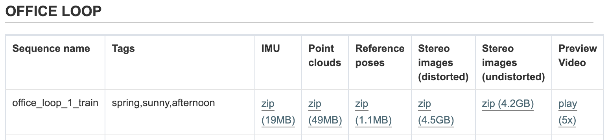
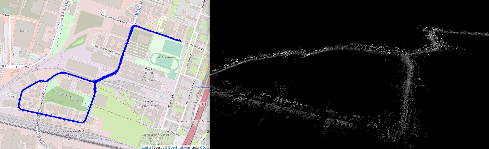
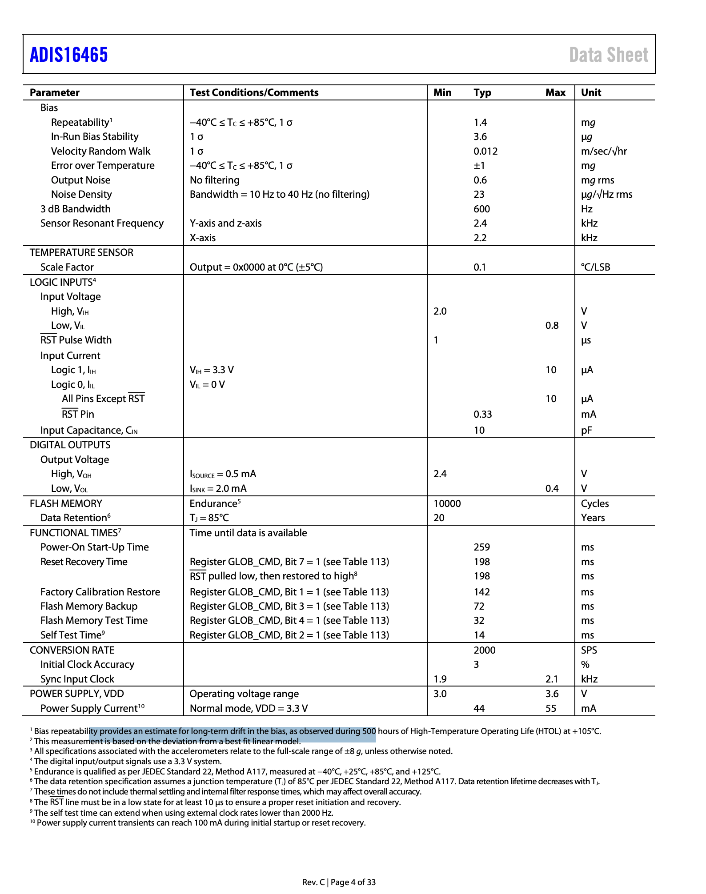
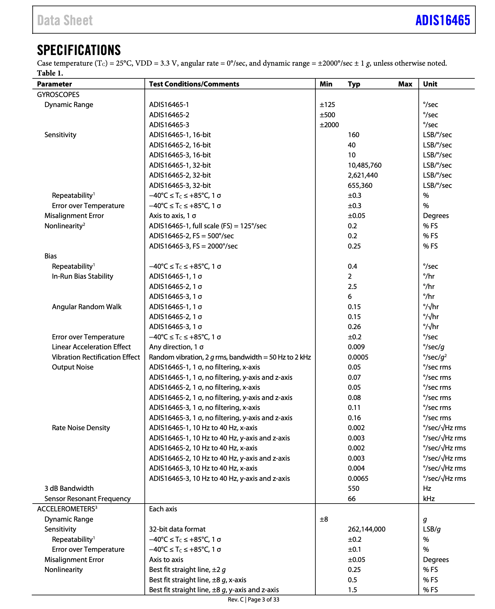

# 4Seasons Dataset Description

## 1. Scenarios

We provide several types of sequences for evaluating visual odometry, global place recognition, and map-based re-localization tracking algorithms:

- **Office Loop** : A loop around an industrial area of the city.
- **Highway** : A loop on the A9 highway in the north part of Munich.
- **Neighborhood** : Traversal thro
- ugh a regular neighborhood at the outskirts of the city covering detached houses with gardens and trees in the street.
- **Business** Campus : Several loops around a campus in a business area around the city.
- **Countryside** : Rural area around agricultural fields which exhibits very homogeneous and repetitive structures. The scene shows heavy vegetation.
- **City Loop** : A large-scale loop at a ring road within the city of Munich including a tunnel.
- **Old Town** : Loop around the urban city center with tall buildings, much traffic, and dynamic objects.
- **Maximilianeum** : The Maximilianeum is a famous palatial building in Munich which is located at the eastern end of a royal avenue with paving stones and a tram route.
- **Parking Garage** : A multi-level (three levels) parking garage to benchmark combined indoor/outdoor environments.

All sequences have been processed to have:

1. consistent timestamps for camera, IMU, and reference poses
2. raw RTK-GNSS measurements
3. distorted/undistorted stereo images

We've tested : 

Figure 1 : _Preview of the downlaod page_

Figure 2 : _Preview of the office loop sequence._

## 2. Sensors Setup
tips : use float64 for timestamps

### 2.1 GNSS(ENU) : `septentrio.nmea`

**GPRMC**: “Recommended Minimum INFO”

    NMEA(GPRMC, time=10:59:49.700000, status=A, lat=48.1963771433, NS=N, lon=11.620472485, EW=E, spd=11.5, cog=53.5, date=2020-12-22, mv=3.6, mvEW=W, posMode=D)

  - **time**: The time at which the GPS fix was taken.
  - status: ‘A’ indicates that the data is valid, ‘V’ indicates that the data is not valid.
  - **lat and lon**: The latitude and longitude values.
  - NS and EW: Indicate the hemisphere of the coordinates: North/South and East/West.
  - **spd**: The speed over ground in knots.
  - **cog**: The Course Over Ground, or the direction the vehicle is currently moving in.
  - **date**: The date when the GPS fix was taken.
  - mv: Magnetic Variation, the difference between magnetic north and true north.
  - mvEW: Magnetic Variation East/West indicator.
  - posMode: Positioning Mode (E.g. ‘D’ for Differential GPS)

**GPGGA** : "Basic Data"

* **time**: The time when the fix was taken.
* **lat and lon**: The latitude and longitude of the fix.
* NS and EW: Indicate the hemisphere of the coordinates: North/South and East/West.
* **quality**: GPS Quality indicator (0 = Invalid; 1 = GPS fix; 2 = DGPS fix, etc.)
* numSV: Number of satellites in use.
* HDOP: Horizontal Dilution of Precision, a measure of the geometric quality of a GPS satellite configuration in the sky.
* **alt**: Altitude above mean sea level.
* altUnit: Altitude units, typically meters.
* sep: Geoidal separation, the difference between the WGS-84 earth ellipsoid and mean-sea-level (geoid).
* sepUnit: Units of geoidal separation, typically meters.
* diffAge: Age of differential GPS data.
* diffStation: Differential reference station ID.

**GPGST** : "quality and uncertainty"

* time: The time when the fix was taken.
* rangeRms: RMS value of the standard deviation of the range inputs to the navigation process.
* stdMajor: Standard deviation of semi-major axis.
* stdMinor: Standard deviation of semi-minor axis.
* orient: Orientation of semi-major axis.
* **stdLat**: Standard deviation of latitude error. (m) E
* **stdLong**: Standard deviation of longitude error. (m) N
* **stdAlt**: Standard deviation of altitude error. (m) U

**We use only quality 4 and 5, which are RTK fixed and RTK float.**

### 2.2 IMU(XYZ = ENU) : `ADIS16465`
2000Hz

        data format : timestamp_ns, gyro_x, gyro_y, gyro_z, acc_x, acc_y, acc_z
        timestamp = timestamp_ns / 1e9

# 3. Data Conversion

## 3.1 timestamp

KF-GINS uses GNSS-WEEK as timestamp (Number of Weeks + Seconds in Week) from 1980-1-6 00:00:00
Also, pay attention to timezones, conversion into UTC is highlt recommended for synchonization.

    def unix2gnssweek(unix_time):
      unix_time = np.array(unix_time, dtype=np.float64)
      print(unix_time[0:10], (unix_time[0:10] - 315964800.0) % 604800.0)
      # week = np.array((unix_time - 315964800) // 604800
      return np.array((unix_time - 315964800.0) % 604800.0)

    def datetime2unix(date_str, time_str):
        # the space in between is necessary
        datetime_str = f"{date_str} {time_str}"
        if "." not in datetime_str:
            datetime_str += ".00000"
        dt = datetime.datetime.strptime(datetime_str, "%Y-%m-%d %H:%M:%S.%f")
        # set time zone to UTC
        dt = dt.replace(tzinfo=datetime.timezone.utc)
        # Convert the datetime object to a Unix timestamp
        return dt.timestamp()  # float

## 3.2 Coordinate System

ENU -> NED

    x_ned = y_enu
    y_ned = x_enu
    z_ned = -z_enu
    
    heading_ned = - heading_enu + 90

